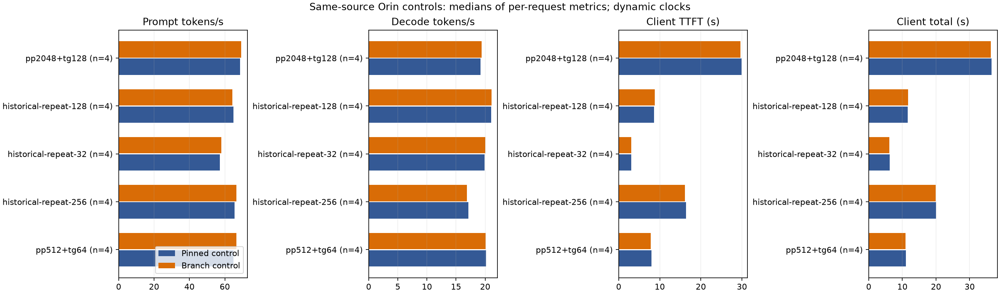

# Same-day paired controls, 2026-10-09

Fresh Jetson Orin measurements of the pinned Strata build and integration branch,
with identical runtime source. No NInfer operator has been promoted, and these
results establish control variability, not an integration speedup. The full
project remains in progress. Build, source, model, tokenizer, MTP and binary
identities are in the [preceding checkpoint](../2026-10-09-integration-controls/README.md).

## Workload and process design

Four independent paired processes per workload; eight successful server starts,
40 measured requests and 40 warmups. Each process warms each cell once before
one measured request. The first three pairs use randomized variant/workload
order (seed 870126); the extension pair reverses variant order (seed 870127).
All five cells match requested prompt/completion counts and have zero prompt
reuse. The server is owned and terminated by the harness between processes.

Both builds use native ARM64 Release, CUDA 12.6.68 and SM87. Both use the verified
Coder shards and MTP runtime packs under `~/models/`, prefill64, context4096,
expert budget5000, mmap experts, prompt-cache0, reserve3072 MiB and pcie-frac0.55.
Actual READY resources match: 6519 expert slots / 12695 MiB, fp16 KV, 11 CPU
workers, MTP maximum4, native verification capacity6 and lookup depth3. Budget
5000 is maximum-size-blob capacity, not actual slot count. Six GiB physical
headroom and the separate three GiB workspace reserve are preserved.

| Actual prompt/generated tokens | Baseline PP tok/s | Branch PP tok/s | Baseline TG tok/s | Branch TG tok/s | Baseline client TTFT s | Branch client TTFT s |
| --- | ---: | ---: | ---: | ---: | ---: | ---: |
| 512 / 64 | 64.94 | 66.48 | 20.16 | 20.09 | 7.95 | 7.76 |
| 2048 / 128 | 68.71 | 69.33 | 19.22 | 19.38 | 29.87 | 29.60 |
| 172 / 64 | 57.27 | 58.08 | 19.90 | 19.99 | 3.08 | 3.02 |
| 557 / 64 | 64.86 | 64.20 | 21.00 | 21.06 | 8.65 | 8.74 |
| 1069 / 64 | 65.59 | 66.54 | 17.13 | 16.89 | 16.36 | 16.12 |

All values are medians of four per-process measured requests. PP/TG derive from
engine counters exposed through `/metrics`; DONE times retain the engine's
reporting precision. Client TTFT means first nonempty reasoning/content SSE
delta; chunks are not presumed individual tokens. Client total excludes metrics
retrieval. [JSON](summary/summary.json) retains median within-pair ratios and
95% intervals from 5000 bootstrap resamples of whole independent pairs. Four
pairs are screening, below the plan's seven-pair confirmation requirement.
Small control differences cannot justify a default or optimization claim.

[Paired ratios and intervals](plots/control-paired-ratios.png) and both SVGs are
retained for export. The long-prompt control's narrow PP interval is an observed
same-source control effect, not evidence of an implemented optimization.

## Memory, clocks and energy scopes

The lowest sampled physical MemAvailable across all eight full process lifetimes
is 8.35 GiB, above the six GiB floor. Request-window minima are distinct from
startup minima and appear in the summary. Swap is present and measured; CPU RSS
is not total CUDA ownership. Raw samples include cgroup ancestors, faults,
process I/O and host disk counters. Shared cgroup ancestors expose no finite
ceiling on this session; the guard still checks all observed ceilings.

MAXN is observed. No clocks or services were changed. These are dynamic-profile
runs. CPU frequency samples and tegrastats are retained for all processes.
GPU/EMC samples are missing for pair0; three other pairs have frequency samples
in every measured request window, at GPU 1300.5 MHz / EMC 3199 MHz. Read-only
clock observations are in [raw samples](evidence/paired-clocks.jsonl) and the
[profile](evidence/observed-clock-profile.txt). Sampling cannot rule out activity
between observations. Do not silently impute pair0 clocks.

Named tegrastats rails are integrated separately over bracketed request windows,
with one-second timestamp granularity and a maximum permitted gap of 2.5 seconds.
These estimates include prefill and decode and are not whole-board energy.
Rails are never summed. Cache hits, drafts offered/accepted, logical model reads
and startup verifier/MTP buffer descriptions are retained. Unique owner-level
graph-pool/reservation/peak bytes remain unsupported; free-memory deltas and
printed buffer descriptions cannot replace them.

## Correctness and explicit failures

- Both binaries pass seven real-model protocol scenarios: repeated greeting,
  OpenAI/Anthropic streaming, cancellation during decode and prefill, and recovery.
  See [baseline](protocol-baseline/protocol.json) and [branch](protocol-candidate/protocol.json).
  This does not establish accepted-prefix persistent-state parity.
- The independent FP64 RMS oracle passes 25 numerical fixtures and eight invalid
  argument checks on the existing Strata CUDA operator. Maximum relative L2 is
  6.954e-8; maximum absolute error is 9.905e-7. Inputs, gamma and guards are
  preserved. [Raw results](weighted-rms-oracle/stdout.txt) use the
  [predeclared contract](../../../docs/integration/OPERATOR_CONTRACTS.md).
  No candidate kernel or performance result is claimed.
- [Fresh four-token comparison](evidence/fresh-four-logit-comparison.json) against
  the pinned CPU llama reference reproduces the known discrepancy: both final
  argmaxes are 248046, maximum absolute difference3.89555, RMS0.76767 and
  KL(reference || Strata)1.30198. This is diagnostic, not a numerical pass.
  Binary/library identities and commands are retained; full logit binaries remain
  under ignored build storage. Reference uses n_ctx256 / eight CPU threads;
  Strata uses prefill1 / no MTP / supported native spec4.
- API message content matches in only 3/4, 0/4, 2/4, 2/4 and 0/4 pairs for
  512/1069/172/557/2048 respectively. Identical runtime source and settings do
  not imply deterministic multi-token text. The cause is unresolved.
- The initial campaign has one completed candidate and five failed port checks.
  A TIME_WAIT precheck bug was fixed and tested before the successful rerun.
  [Failed campaign](failed-initial-campaign/campaign.json) and logs are preserved
  and excluded from paired medians. They are harness failures, not capacity cells.
- The initial plot attempt lacked matplotlib; its failure is retained. Plots
  were generated with an existing isolated matplotlib environment.

The current harness suite passes 31 tests. Two final maintenance checks bound
readiness HTTP reads and reject nonfinite stage rates; the retained 29-test log
predates those fixes. `harness-source-identities.json` records the measured
checkpoint; `harness-source-identities-final.json` records this final harness. Earlier setup/core/mock API results
remain explicitly scoped in the preceding checkpoint. NInfer model cohorts,
HIP/SYCL rebuilds, unique-allocation accounting, exact codec adapters,
accepted-prefix state tests, held-out confirmation, long-context quality and
30-minute sustained serving are not performed by this checkpoint. Production
runtime/default paths remain unchanged.

## Evidence and reproduction

`paired/` holds three completed pairs; `extension/` holds pair3. Original command
paths are preserved, even though build directories are local and ignored.
`combined-campaign.json` records their nonmutating analysis union. To recompute,
create a temporary campaign directory with block directories linked to these
published copies, copy `combined-campaign.json` to its `campaign.json`, then run
`summarize_controls.py` with `evidence/paired-clocks.jsonl`. Summarization reads
campaign-relative block directories; it does not execute retained commands.
Engine logs are renamed `.txt` for Git retention. No models, compiled binaries,
credentials or local agent configuration are included. SHA256 for every retained
file is in `SHA256SUMS.json`.

See [harness commands](../../../docs/integration/PHASE1.md),
[status](../../../docs/integration/STATUS.md) and
[Splash notebook](../../../docs/integration/PORTING_NOTES.md).
